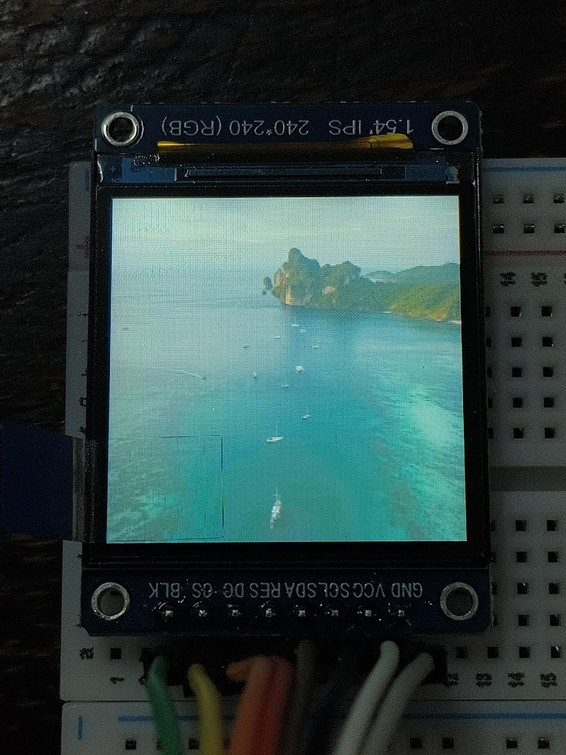

# Convert2RGB565
Convert PNG/JPG to RGB565 for IPS/OLED Arduino/Pi Display
## Dependencies
This project requires the following libraries:
- **Python (for image conversion)**  
  - [Pillow (PIL)](https://pypi.org/project/pillow/)
## Demo

